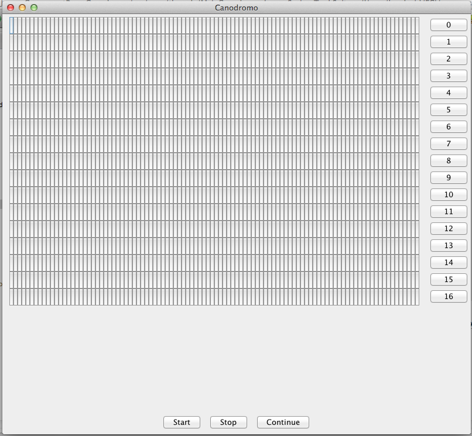

### Escuela Colombiana de Ingeniería
### Nikolai Bermudez Vega - Verbo Julian Camacho
### Arquitecturas de Software – ARSW
## Laboratorio Programación concurrente, condiciones de carrera, esquemas de sincronización, colecciones sincronizadas y concurrentes - Caso Dogs Race

### Descripción:
Este ejercicio tiene como fin que el estudiante conozca y aplique conceptos propios de la programación concurrente.

### Parte I 
Antes de terminar la clase.

Creación, puesta en marcha y coordinación de hilos.

1. Revise el programa “primos concurrentes” (en la carpeta parte1), dispuesto en el paquete edu.eci.arsw.primefinder. Este es un programa que calcula los números primos entre dos intervalos, distribuyendo la búsqueda de los mismos entre hilos independientes. Por ahora, tiene un único hilo de ejecución que busca los primos entre 0 y 30.000.000. Ejecútelo, abra el administrador de procesos del sistema operativo, y verifique cuantos núcleos son usados por el mismo.

>Se puede ver en l imagen que al ejecutar el programa y abrir el administrador podemos observar como al tener un unico hilo se ve el porcentaje de uso es aproximadamente de 41%
2. Modifique el programa para que, en lugar de resolver el problema con un solo hilo, lo haga con tres, donde cada uno de éstos hará la tarcera parte del problema original. Verifique nuevamente el funcionamiento, y nuevamente revise el uso de los núcleos del equipo.

>Se puede ver en la imagen que al ejecutar mas hilos usa mas nucleos en un menor tiempo, siendo un pocentaje mucho mayor casi siendo 56%
3. Lo que se le ha pedido es: debe modificar la aplicación de manera que cuando hayan transcurrido 5 segundos desde que se inició la ejecución, se detengan todos los hilos y se muestre el número de primos encontrados hasta el momento. Luego, se debe esperar a que el usuario presione ENTER para reanudar la ejecución de los mismo.


### Parte II 


Para este ejercicio se va a trabajar con un simulador de carreras de galgos (carpeta parte2), cuya representación gráfica corresponde a la siguiente figura:



En la simulación, todos los galgos tienen la misma velocidad (a nivel de programación), por lo que el galgo ganador será aquel que (por cuestiones del azar) haya sido más beneficiado por el *scheduling* del
procesador (es decir, al que más ciclos de CPU se le haya otorgado durante la carrera). El modelo de la aplicación es el siguiente:


Como se observa, los galgos son objetos ‘hilo’ (Thread), y el avance de los mismos es visualizado en la clase Canodromo, que es básicamente un formulario Swing. Todos los galgos (por defecto son 17 galgos corriendo en una pista de 100 metros) comparten el acceso a un objeto de tipo
RegistroLLegada. Cuando un galgo llega a la meta, accede al contador ubicado en dicho objeto (cuyo valor inicial es 1), y toma dicho valor como su posición de llegada, y luego lo incrementa en 1. El galgo que
logre tomar el ‘1’ será el ganador.

Al iniciar la aplicación, hay un primer error evidente: los resultados (total recorrido y número del galgo ganador) son mostrados antes de que finalice la carrera como tal. Sin embargo, es posible que una vez corregido esto, haya más inconsistencias causadas por la presencia de condiciones de carrera.

>Se corrigio el error donde el ganador se mostraba antes de finalizar la carrera, ahora muestra el verdadero ganador despues de la carrera.

Parte III

1.  Corrija la aplicación para que el aviso de resultados se muestre
    sólo cuando la ejecución de todos los hilos ‘galgo’ haya finalizado.
    Para esto tenga en cuenta:

    a.  La acción de iniciar la carrera y mostrar los resultados se realiza a partir de la línea 38 de MainCanodromo.

    b.  Puede utilizarse el método join() de la clase Thread para sincronizar el hilo que inicia la carrera, con la finalización de los hilos de los galgos.

```java

new Thread() {
public void run() {
        for (int i = 0; i < can.getNumCarriles(); i++) {
        //crea los hilos 'galgos'
        galgos[i] = new Galgo(can.getCarril(i), "" + i, reg);
        //inicia los hilos
        galgos[i].start();
        }
        for (int i = 0; i < can.getNumCarriles()+1; i++) {
        try {
        if(i<can.getNumCarriles()){
            galgos[i].join();
        }else{
        can.winnerDialog(reg.getGanador(),reg.getUltimaPosicionAlcanzada()-1);
        System.out.println("El ganador fue:" + reg.getGanador());
        }

        } catch (InterruptedException interruptedException) {
        interruptedException.printStackTrace();
        }


        }

        }

        }.start();
```

2.  Una vez corregido el problema inicial, corra la aplicación varias
    veces, e identifique las inconsistencias en los resultados de las
    mismas viendo el ‘ranking’ mostrado en consola (algunas veces
    podrían salir resultados válidos, pero en otros se pueden presentar
    dichas inconsistencias). A partir de esto, identifique las regiones
    críticas () del programa.
    
>Encontramos inconsistencias en varios resultados como el de primer lugar, ya que salía más de un jugador como si tuvieran el 1 puesto. Para esto utilizamos *syncronized()* organizando cada hilo para que cada uno de ellos sepa su respectivo resultado.

3.  Utilice un mecanismo de sincronización para garantizar que a dichas
    regiones críticas sólo acceda un hilo a la vez. Verifique los
    resultados.

4.  Implemente las funcionalidades de pausa y continuar. Con estas,
    cuando se haga clic en ‘Stop’, todos los hilos de los galgos
    deberían dormirse, y cuando se haga clic en ‘Continue’ los mismos
    deberían despertarse y continuar con la carrera. Diseñe una solución que permita hacer esto utilizando los mecanismos de sincronización con las primitivas de los Locks provistos por el lenguaje (wait y notifyAll).

## Programa pausado - stop()


## Programa reanudado - continue()


### Salida

```java
        Carrera pausada!
        Carrera reanudada!
        Carrera pausada!
        Carrera reanudada!
        El galgo 15 llego en la posicion 2
        El galgo 6 llego en la posicion 13
        El galgo 16 llego en la posicion 10
        El galgo 11 llego en la posicion 11
        El galgo 4 llego en la posicion 12
        El galgo 9 llego en la posicion 9
        El galgo 13 llego en la posicion 8
        El galgo 0 llego en la posicion 1
        El galgo 12 llego en la posicion 7
        El galgo 2 llego en la posicion 3
        El galgo 8 llego en la posicion 6
        El galgo 10 llego en la posicion 5
        El galgo 3 llego en la posicion 4
        El galgo 5 llego en la posicion 17
        El galgo 14 llego en la posicion 16
        El galgo 1 llego en la posicion 15
        El galgo 7 llego en la posicion 14
        El ganador fue:0
```
